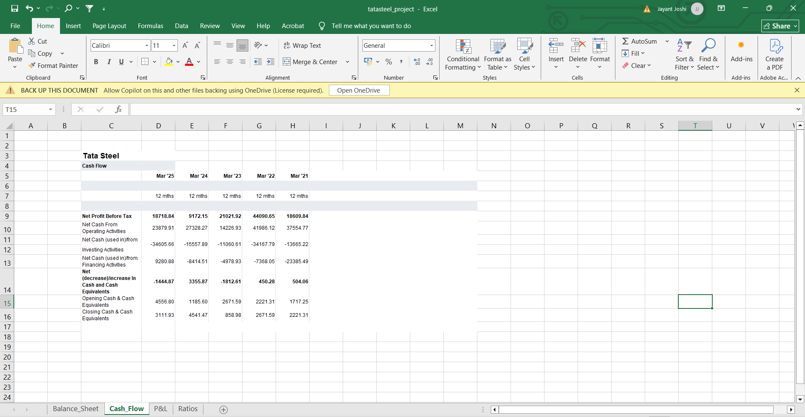

# Forging Financial Insights

This repository contains a comprehensive financial analysis of **Tata Steel** over the past five financial years (FY2021–FY2025). The dataset was manually extracted from company filings and structured into Excel sheets, followed by a deep dive into key financial statements and ratio trends.

---

## 📁 Contents

- `Balance_Sheet`: Key financial position data (assets, liabilities, equity).
- 
- 
- `P&L`: Profit & Loss statement including income, expenses, and profit trends.
- 
- `Cash_Flow`: Analysis of cash inflows and outflows from operations, investing, and financing activities.
- 
- `Ratios`: Financial ratios covering profitability, liquidity, solvency, and efficiency.
- 
- `Ratio Charts`: Visual representations of ratio trends to support time-series analysis.
- 

  

---

## 📈 Visualizations

To aid interpretation, I’ve created charts for several financial ratios including:
- **Gross Profit Margin**
- **Net Profit Margin**
- **Return on Equity (ROE)**
- **Debt-to-Equity Ratio**
- **Inventory Turnover**
- and more...

These visualizations highlight the company’s performance trajectory and help identify strengths, weaknesses, and patterns.

---

## 🧠 Key Insights

- **Profitability**: Tata Steel’s gross and net profit margins saw consistent improvement post-FY2022, reflecting recovery from pandemic lows.
- **Liquidity**: The current and quick ratios remain below 1 in recent years, indicating possible short-term liquidity constraints.
- **Solvency**: Debt-to-equity has shown a declining trend, suggesting improving leverage.
- **Efficiency**: A significant rise in debtor turnover implies improved receivables management.

---

## 🔧 Tools Used

- Microsoft Excel
- Charting tools (Excel's native chart system)
- Manual data cleaning and formatting

---

---

## 👤 Author

**Jayant Joshi**  
Mechanical Engineering, DTU  
